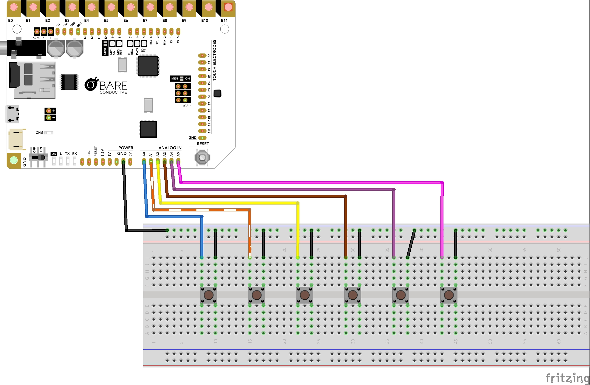

# How to use the Touch Board as a Switch (open/closed circuits)

----
## DESCRIPTION

So far we've used the Touch Board's electrodes as capacitive sensors, reacting to touch and proximity. In this section we'll use the Touch Board differently: as a sound player triggered by simple switches. Instead of sensing a hand, the board checks whether a circuit is open or closed. When a button is pressed, a switch is flipped or two contacts meet, the circuit closes and a sound plays.

This approach is more reliable than capacitive touch, and it opens up a different kind of interaction: objects that respond to being used. A door that's opened, a lid that's lifted, a phone handset that's picked up or a mat that's stepped on can all become triggers. 

We'll connect switches to the board's A0–A5 pins, ask a hackSpace technician if you have the right board to make these connections.

----
## HARDWARE

- Bare Conductive Touch Board (with headers soldered)

- microSD card

- (x6) push button (or any materials to open/close the circuit)

- hamburger speaker

- jumper wires

----
## WIRING

*Note: click on image to expand

----
## CODE and INSTRUCTIONS

- Soundtracks should be already loaded in the microSD-card. They should be titled "TRACK000.mp3, TRACK001.mp3 ... -> TRACK005.mp3

- Plug the Bare Conductive Board to your computer (if you haven't already)

- Plug the hamburger speaker to your board and turn it on. 

- Turn the board ON (if you haven't already)

- In your Arduino IDE, remember to select the corresponding  BOARD and PORT

- Upload [this code](https://github.com/kingston-hackSpace/Capacitive-Touch-Sensors/blob/main/Bare_Conduct_buttons.ino) to your board

- Press the buttons! You should hear the soundtracks being triggered by the buttons. 

